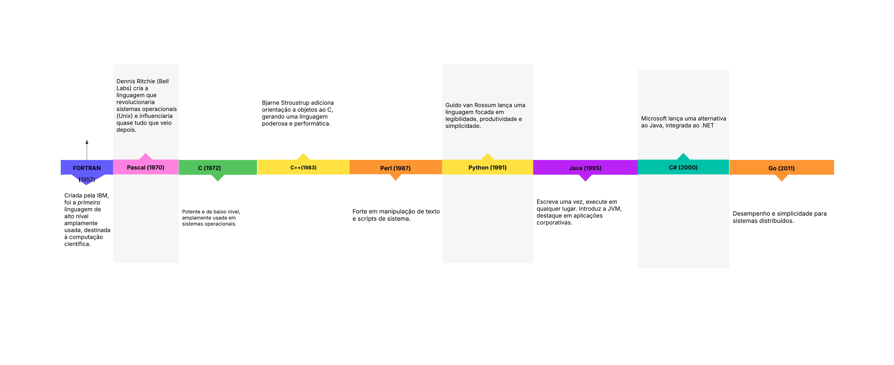

# Introdução às Linguagens de Programação

Este repositório reúne conteúdos e exercícios relacionados aos principais temas de linguagens de programação, incluindo tipos de dados, estruturas de controle, subprogramas, ambientes de execução e muito mais.

## Introdução: A Evolução das Linguagens de Programação

As linguagens de programação evoluíram junto com a tecnologia, acompanhando diferentes paradigmas, arquiteturas e necessidades de abstração. Abaixo, uma linha do tempo com marcos importantes:

### Linha do Tempo das Linguagens de Programação

| Ano | Linguagem     | Destaques                                                                 |
|-----|----------------|---------------------------------------------------------------------------|
| 1957| **FORTRAN**    | Primeira linguagem de alto nível, voltada para cálculo numérico.         |
| 1970| **Pascal**     | Ênfase em boas práticas e programação estruturada.                       |
| 1972| **C**          | Potente e de baixo nível, amplamente usada em sistemas operacionais.     |
| 1983| **C++**        | Introduziu orientação a objetos ao C.                                     |
| 1987| **Perl**       | Forte em manipulação de texto e scripts de sistema.                      |
| 1991| **Python**     | Simples e legível, voltada à produtividade e clareza.                    |
| 1995| **Java**       | Portabilidade com JVM, muito usada em sistemas corporativos.             |
| 1995| **JavaScript** | Linguagem da web, executada no navegador.                                |
| 2000| **C#**         | Criada pela Microsoft para a plataforma .NET.                            |
| 2009| **Go**         | Desempenho e simplicidade para sistemas distribuídos.                    |
| 2010| **Rust**       | Segurança de memória sem coletor de lixo.                                |
| 2014| **Swift**      | Nova linguagem da Apple para iOS/macOS.                                  |

