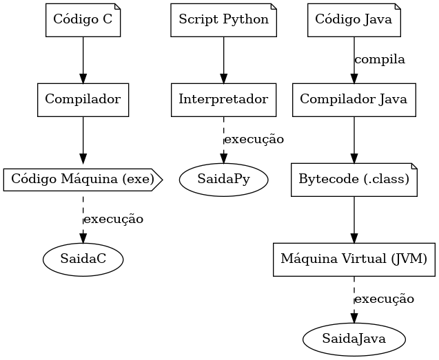

# Ambientes de Programação

Este material explica, com diagrama e exemplos, os três principais tipos de ambientes de execução de programas:

## 1. Compiladores

Um **compilador** traduz todo o código fonte para código de máquina **antes da execução**.

### Exemplo:
- Linguagem: **C**
- Processo: `código.c` → compilador → `código.exe` → executado pelo sistema operacional

## 2. Interpretadores

Um **interpretador** executa o código fonte **linha por linha** durante a execução.

### Exemplo:
- Linguagem: **Python**
- Processo: `script.py` → interpretador → execução direta

## 3. Máquinas Virtuais (VMs)

A **máquina virtual** executa um código intermediário (bytecode), permitindo portabilidade entre sistemas.

### Exemplo:
- Linguagem: **Java**
- Processo: `codigo.java` → compilador → `bytecode (.class)` → JVM → execução

---

