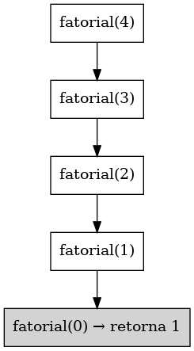

# Implementação de Subprogramas

## Exemplo: Fatorial Recursivo

Neste exemplo, utilizamos a recursão para calcular o fatorial de um número. A função chama a si mesma até atingir a condição base (`n == 0`).

### Código em Python

```python
def fatorial(n):
    if n == 0:
        return 1
    else:
        return n * fatorial(n - 1)

print(fatorial(4))  
```

---

## Pilha de Chamadas

Ao chamar `fatorial(4)`, a pilha de chamadas cresce com cada chamada recursiva até atingir a base.

### Desenho da Pilha

(Passo a passo do topo da pilha até a base)

```
fatorial(4)
 └── fatorial(3)
       └── fatorial(2)
             └── fatorial(1)
                   └── fatorial(0) → retorna 1
```

### Retornos

```
fatorial(1) → 1 * 1 = 1
fatorial(2) → 2 * 1 = 2
fatorial(3) → 3 * 2 = 6
fatorial(4) → 4 * 6 = 24
```


