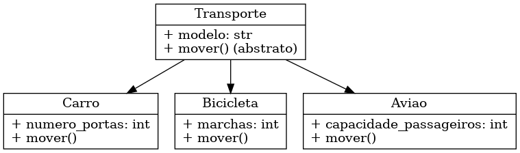

# Sistema de Modelagem de Transportes

Este projeto apresenta um exemplo simples de modelagem de classes utilizando Programação Orientada a Objetos (POO) no domínio de **Transportes**.

## Objetivo

Demonstrar conceitos fundamentais da POO como:
- Herança
- Encapsulamento
- Polimorfismo
- Abstração

## Hierarquia de Classes

```
Transporte (classe base)
├── Carro
├── Bicicleta
└── Aviao
```

Cada classe herda da classe `Transporte` e implementa comportamentos específicos, como `mover()`.

## Exemplo de Uso

```python
from transporte import Carro, Bicicleta, Aviao

carro = Carro("Fiat Uno", 4)
bike = Bicicleta("Caloi", 21)
aviao = Aviao("Boeing 737", 180)

for veiculo in [carro, bike, aviao]:
    veiculo.mover()
```


